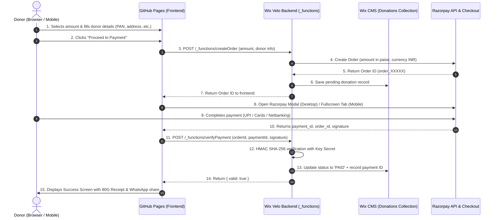

#  Ritinjali Donation Platform — Architecture & Deployment Guide

[](https://pages.github.com/)
[](https://www.wix.com/velo)
[](https://razorpay.com/)
[](LICENSE)
[]()

> A modern, responsive, two-step donation widget with 80G tax benefit capture, seamless Razorpay payment breakout for mobile and desktop, and a secure serverless backend hosted on Wix Velo with database persistence.

---

## 📑 Table of Contents
1. [Architecture Overview](#-architecture-overview)
2. [Prerequisites & Account Setup](#-prerequisites--account-setup)
3. [Step 1: Razorpay Dashboard Configuration](#-step-1-razorpay-dashboard-configuration)
4. [Step 2: Wix Backend Setup (Velo HTTP Functions)](#-step-2-wix-backend-setup-velo-http-functions)
5. [Step 3: Wix Database Collection Configuration](#-step-3-wix-database-collection-configuration)
6. [Step 4: Frontend Deployment on GitHub Pages](#-step-4-frontend-deployment-on-github-pages)
7. [Step 5: Embedding in Wix Website](#-step-5-embedding-in-wix-website)
8. [Step 6: End-to-End Testing & Verification](#-step-6-end-to-end-testing--verification)
9. [Security & Production Hardening](#-security--production-hardening)
10. [Troubleshooting & FAQ](#-troubleshooting--faq)

---

## 🏛 Architecture Overview



### Key Highlights
- **No Hosting Cost**: Frontend is permanently served over HTTPS via GitHub Pages (with optional custom domain `donate.ritinjali.org`).
- **Zero Server Maintenance**: Serverless Wix Velo HTTP endpoints handle order creation, signature verification, and database storage.
- **Strict Payment Security**: Secret keys never touch client code. Server-side HMAC SHA-256 prevents tampering or fraudulent status spoofing.
- **Mobile-First UX**: Responsive viewport auto-scaling (14px–16px root font), 44px touch targets, mobile numeric keypad trigger, and native browser breakout to avoid restricted iframe payment blocks.

---

## 📋 Prerequisites & Account Setup

| Service | Role | Required Details |
| :--- | :--- | :--- |
| **GitHub** | Code repository & CDN hosting | GitHub account with repository permissions |
| **Wix** | CMS, backend API & custom domain hosting | Wix Premium site with Velo (Dev Mode) enabled |
| **Razorpay** | Payment Gateway | Activated business account (Standard Checkout enabled) |
| **Domain Registrar / DNS** | Custom sub-domain routing | Access to DNS records for CNAME configuration |

---

##  Step 1: Razorpay Dashboard Configuration

### 1.1 Generate API Keys
1. Log in to your [Razorpay Dashboard](https://dashboard.razorpay.com/).
2. Navigate to **Settings** (bottom-left) → **API Keys**.
3. Toggle to **Test Mode** (for trial) or **Live Mode** (for real collections).
4. Click **Generate Key**.
5. Save the credentials securely:
   - `Key ID` (e.g., `rzp_live_TbnBUVllLD3B5v` or `rzp_test_XXXXXX`) — **Public**
   - `Key Secret` (e.g., `aBcDeFg1234567890`) — **Confidential (Never commit to Git!)**

### 1.2 Enable Payment Methods
Under **Settings** → **Payment Methods**, ensure the following are enabled:
- ✅ **UPI / QR** (Google Pay, PhonePe, Paytm, BHIM)
- ✅ **Debit / Credit Cards** (Visa, MasterCard, RuPay, Amex)
- ✅ **Netbanking** (All major Indian banks)
- ✅ **Wallets** (Optional)

---

##  Step 2: Wix Backend Setup (Velo HTTP Functions)

Wix Velo exposes serverless HTTP endpoints using a special backend file called `http-functions.js`.

### 2.1 Enable Dev Mode in Wix
1. Open your Wix site in the **Wix Editor**.
2. In the top navigation bar, click **Dev Mode** → **Turn on Dev Mode**.

### 2.2 Store Secret Keys in Wix Secrets Manager
Never hardcode secrets in code! Use the built-in Wix Secrets Manager:
1. In the Wix Dashboard, go to **Developer Tools** → **Secrets Manager**.
2. Click **Store a Secret** and add:
   - **Name**: `RAZORPAY_KEY_ID` | **Value**: `<Your Razorpay Key ID>`
   - **Name**: `RAZORPAY_KEY_SECRET` | **Value**: `<Your Razorpay Key Secret>`

### 2.3 Install NPM Dependencies
In the Velo sidebar (Code Files):
1. Expand **Packages (npm)**.
2. Click **Install Package from npm**.
3. Search for and install:
   - `crypto-js` *(used for cryptographic HMAC-SHA256 signature verification)*

---

### 2.4 Create `backend/http-functions.js`
In the Velo sidebar, under **Backend**, click **+ Add New File** → **HTTP Functions** (name it `http-functions.js`).

Paste the complete code below:

```javascript
import { ok, badRequest, serverError, response } from 'wix-http-functions';
import wixData from 'wix-data';
import wixSecretsBackend from 'wix-secrets-backend';
import CryptoJS from 'crypto-js';

// ==========================================
// CORS Headers Configuration
// ==========================================
function getCorsHeaders() {
    return {
        'Access-Control-Allow-Origin': '*', // Replace with 'https://donate.ritinjali.org' in production
        'Access-Control-Allow-Methods': 'POST, OPTIONS',
        'Access-Control-Allow-Headers': 'Content-Type, Authorization',
    };
}

// Preflight handler for createOrder
export function options_createOrder(request) {
    return response({
        status: 204,
        headers: getCorsHeaders(),
    });
}

// Preflight handler for verifyPayment
export function options_verifyPayment(request) {
    return response({
        status: 204,
        headers: getCorsHeaders(),
    });
}

// ==========================================
// 1. Endpoint: POST /_functions/createOrder
// ==========================================
export async function post_createOrder(request) {
    const headers = getCorsHeaders();

    try {
        const body = await request.body.json();
        const { amount, currency = 'INR', donor = {} } = body;

        if (!amount || isNaN(amount) || Number(amount) < 1) {
            return badRequest({
                headers,
                body: { error: 'Invalid donation amount.' },
            });
        }

        // Fetch Razorpay credentials from Secrets Manager
        const keyId = await wixSecretsBackend.getSecret('RAZORPAY_KEY_ID');
        const keySecret = await wixSecretsBackend.getSecret('RAZORPAY_KEY_SECRET');

        // Amount in paise (1 INR = 100 paise)
        const amountPaise = Math.round(Number(amount) * 100);

        // Prepare basic auth for Razorpay API
        const auth = Buffer.from(`${keyId}:${keySecret}`).toString('base64');

        // Call Razorpay Orders API
        const rzpResponse = await fetch('https://api.razorpay.com/v1/orders', {
            method: 'POST',
            headers: {
                'Authorization': `Basic ${auth}`,
                'Content-Type': 'application/json',
            },
            body: JSON.stringify({
                amount: amountPaise,
                currency: currency,
                receipt: `rcpt_${Date.now()}`,
                notes: {
                    donorName: donor.name || 'Anonymous',
                    email: donor.email || '',
                    phone: donor.phone || '',
                    pan: donor.pan || '',
                    citizen: donor.citizenType || 'indian',
                    donationType: donor.donationType || 'onetime',
                }
            }),
        });

        const orderData = await rzpResponse.json();

        if (!rzpResponse.ok || !orderData.id) {
            return serverError({
                headers,
                body: { error: orderData.error ? orderData.error.description : 'Failed to create Razorpay order' },
            });
        }

        // Persist pending donation to Wix CMS Database
        await wixData.insert('Donations', {
            orderId: orderData.id,
            amount: Number(amount),
            donorName: donor.name || 'Anonymous',
            email: donor.email || '',
            phone: donor.phone || '',
            pan: (donor.pan || '').toUpperCase(),
            address: donor.address || '',
            city: donor.city || '',
            state: donor.state || '',
            country: donor.country || 'India',
            donationType: donor.donationType || 'onetime',
            coverCharges: Boolean(donor.coverCharges),
            anonymous: Boolean(donor.anonymous),
            status: 'PENDING',
            createdAt: new Date(),
        });

        return ok({
            headers,
            body: {
                id: orderData.id,
                amount: orderData.amount,
                currency: orderData.currency,
            },
        });
    } catch (err) {
        console.error('[createOrder Error]', err);
        return serverError({
            headers,
            body: { error: err.message || 'Internal server error' },
        });
    }
}

// ==========================================
// 2. Endpoint: POST /_functions/verifyPayment
// ==========================================
export async function post_verifyPayment(request) {
    const headers = getCorsHeaders();

    try {
        const body = await request.body.json();
        const { orderId, paymentId, signature } = body;

        if (!orderId || !paymentId || !signature) {
            return badRequest({
                headers,
                body: { error: 'Missing payment signature verification parameters.' },
            });
        }

        const keySecret = await wixSecretsBackend.getSecret('RAZORPAY_KEY_SECRET');

        // Generate expected signature using HMAC-SHA256
        const textToSign = `${orderId}|${paymentId}`;
        const generatedSignature = CryptoJS.HmacSHA256(textToSign, keySecret).toString(CryptoJS.enc.Hex);

        const isSignatureValid = (generatedSignature === signature);

        if (!isSignatureValid) {
            console.error('[Verification Failed] Signature mismatch');
            return ok({
                headers,
                body: { valid: false, message: 'Invalid payment signature' },
            });
        }

        // Query and update the record in Wix Data Collection
        const results = await wixData.query('Donations')
            .eq('orderId', orderId)
            .limit(1)
            .find();

        if (results.items.length > 0) {
            const donationRecord = results.items[0];
            donationRecord.paymentId = paymentId;
            donationRecord.signature = signature;
            donationRecord.status = 'PAID';
            donationRecord.paidAt = new Date();

            await wixData.update('Donations', donationRecord);
        }

        return ok({
            headers,
            body: {
                valid: true,
                orderId,
                paymentId,
            },
        });
    } catch (err) {
        console.error('[verifyPayment Error]', err);
        return serverError({
            headers,
            body: { error: err.message || 'Payment verification failed' },
        });
    }
}
```

---

## 🗄 Step 3: Wix Database Collection Configuration

1. In the Wix Dashboard, open **CMS** → **Your Collections**.
2. Click **+ Create Collection** and name it: `Donations`.
3. Set Collection Permissions:
   - **Who can view content?**: *Admin only* (or Site member author)
   - **Who can add content?**: *Anyone* (or via backend code)
4. Add the following fields:

| Field Name | Field Key | Field Type | Description |
| :--- | :--- | :--- | :--- |
| **Order ID** | `orderId` | Text | Razorpay generated order id (`order_XXX`) |
| **Payment ID** | `paymentId` | Text | Razorpay payment transaction id (`pay_XXX`) |
| **Amount** | `amount` | Number | Donation amount in INR |
| **Donor Name** | `donorName` | Text | Full name for 80G tax receipt |
| **Email** | `email` | Text | Donor email for tax receipt delivery |
| **Phone** | `phone` | Text | 10-digit mobile number |
| **PAN Number** | `pan` | Text | Indian PAN for 80G tax benefits |
| **Address** | `address` | Text | Complete postal address |
| **City** | `city` | Text | Donor city |
| **State** | `state` | Text | Donor state / province |
| **Country** | `country` | Text | Country of residence |
| **Status** | `status` | Text | `PENDING`, `PAID`, or `FAILED` |
| **Created At** | `createdAt` | Date & Time | Timestamp when order was placed |
| **Paid At** | `paidAt` | Date & Time | Timestamp when payment succeeded |

---

## 🚀 Step 4: Frontend Deployment on GitHub Pages

The frontend consists of pure, lightweight Vanilla HTML, CSS, and JS with zero framework dependencies.

### 4.1 Update API Endpoints & Key ID
In `dscript.js` (or `script.js` / `all.html`), verify your production constants:

```javascript
const WIX_BASE_URL = 'https://www.ritinjali.org'; // Your production Wix domain

const RAZORPAY_CONFIG = {
    keyId: 'rzp_live_TbnBUVllLD3B5v', // Your Live Key ID
    orgName: 'Ritinjali',
    logoUrl: 'https://static.wixstatic.com/.../logo.jpg',
    themeColor: '#177A47',
    currency: 'INR',
};
```

### 4.2 Push Code to GitHub
```bash
git add .
git commit -m "feat: complete responsive donation widget with Razorpay live integration"
git push origin main
```

### 4.3 Configure GitHub Pages
1. On GitHub, go to your repository: **Settings** → **Pages** (left menu).
2. Under **Build and deployment**:
   - **Source**: `Deploy from a branch`
   - **Branch**: `main` | **Folder**: `/ (root)`
3. Click **Save**.

### 4.4 Custom Subdomain (e.g. `donate.ritinjali.org`)
1. Ensure the `CNAME` file exists in the repository root containing your subdomain:
   ```text
   donate.ritinjali.org
   ```
2. In your DNS Provider (GoDaddy, Cloudflare, Namecheap, or Wix DNS):
   - Add a `CNAME` record:
     - **Type**: `CNAME`
     - **Host / Name**: `donate`
     - **Target / Value**: `<your-github-username>.github.io`
     - **TTL**: `Auto` or `3600`
3. Back in GitHub Settings → Pages, check **Enforce HTTPS**.

---

## 🖥 Step 5: Embedding in Wix Website

You can embed the widget directly onto any Wix page using the Wix HTML Component.

### 5.1 Add the Embed Element
1. Open the **Wix Editor**.
2. Navigate to your **Donate** page.
3. Click **+ Add Elements** → **Embed Code** → **Embed HTML** (HTML iframe).
4. Drag the element to the desired location.

### 5.2 Configure Embed Settings
In the iframe settings dialog:
- **What do you want to add?**: Select **Website Address (URL)**
- **Website address**:
  ```text
  https://donate.ritinjali.org
  ```
  *(Or `https://<username>.github.io/ritinjali-donate/all.html` if using standard GitHub Pages)*

### 5.3 Dimensions & Layout
- **Desktop Dimensions**: Set width to **`525px`** and height to **`535px`**.
- **Mobile View**:
  1. Switch to **Mobile Editor** view in Wix.
  2. Select the HTML widget.
  3. Ensure the width fits the mobile canvas (~320px–360px) and height is set to **`535px`**.
  4. The widget automatically optimizes touch targets, eliminates dead space, and uses flex distribution to fit without inner scrollbars.

---

## 🧪 Step 6: End-to-End Testing & Verification

Follow this test matrix before announcing collections:

| # | Test Case | Expected Result | Pass/Fail |
| :-: | :--- | :--- | :-: |
| 1 | **Toggle Frequency** | Switches between "One Time" and "Monthly" | 🔲 |
| 2 | **Amount Selection** | Selecting amounts updates impact description box | 🔲 |
| 3 | **Custom "Others" Amount** | Numeric input appears with no stepper arrows, accepts min ₹100 | 🔲 |
| 4 | **3% Gateway Fee Checkbox** | Automatically calculates and adds 3% to total amount | 🔲 |
| 5 | **Step 1 Validation** | Foreign Citizen directs to FCRA flow; "Others" requires valid amount | 🔲 |
| 6 | **Step 2 Form Validation** | Validates 10-char Indian PAN (`ABCDE1234F`), valid email & 10-digit phone | 🔲 |
| 7 | **Desktop Checkout** | Opens centered popup modal (`RazorpayModal`) without popup blocker issues | 🔲 |
| 8 | **Mobile Checkout** | Seamlessly opens full-screen browser window for UPI / GPay / Cards | 🔲 |
| 9 | **Signature Verification** | Backend validates HMAC-SHA256 and updates status to `PAID` in CMS | 🔲 |
| 10 | **Receipt & Social Share** | Displays donation receipt ID and working WhatsApp share button | 🔲 |

---

## 🛡 Security & Production Hardening

> [!IMPORTANT]
> **Production Security Rules:**
> 1. **Secret Isolation**: Never add `RAZORPAY_KEY_SECRET` inside any client-side HTML, CSS, or JS files. Keep it strictly in Wix Secrets Manager.
> 2. **Signature Check**: Never trust the frontend callback blindly. Only mark donations as `PAID` when `post_verifyPayment` cryptographically matches the hash.
> 3. **PAN Compliance**: Indian donors claiming 80G tax exemptions require mandatory PAN verification for annual 10BD income tax filing.

---

##  Troubleshooting & FAQ

<details>
<summary><strong>Q: I get a CORS error when calling <code>/_functions/createOrder</code>?</strong></summary>

**Cause**: The browser is sending an `OPTIONS` preflight request that isn't answered with the proper CORS headers.  
**Fix**: Ensure `options_createOrder` and `options_verifyPayment` functions exist in `http-functions.js` and return HTTP `204` with `Access-Control-Allow-Origin: *`.
</details>

<details>
<summary><strong>Q: Mobile UPI payment fails or Razorpay popup is blocked inside Wix?</strong></summary>

**Cause**: Standard mobile iframes have `sandbox` or cross-origin restrictions that prevent deep-linking to UPI apps (Google Pay, PhonePe, Paytm).  
**Fix**: The implementation in `all.html` detects mobile browsers (`window.innerWidth < 768` or mobile UA) and automatically breaks out into a dedicated tab before calling Razorpay, ensuring 100% UPI intent flow compatibility.
</details>

<details>
<summary><strong>Q: Why is the PAN automatically capitalized?</strong></summary>

**Answer**: Indian PAN format requires uppercase letters (`ABCDE1234F`). The input event listener automatically converts all keystrokes to uppercase to prevent input errors.
</details>

---

##  License & Attribution
- **Organization**: [Ritinjali](https://www.ritinjali.org) (Registered Non-Profit established in 1995)
- **License**: Released under the [MIT License](LICENSE).
